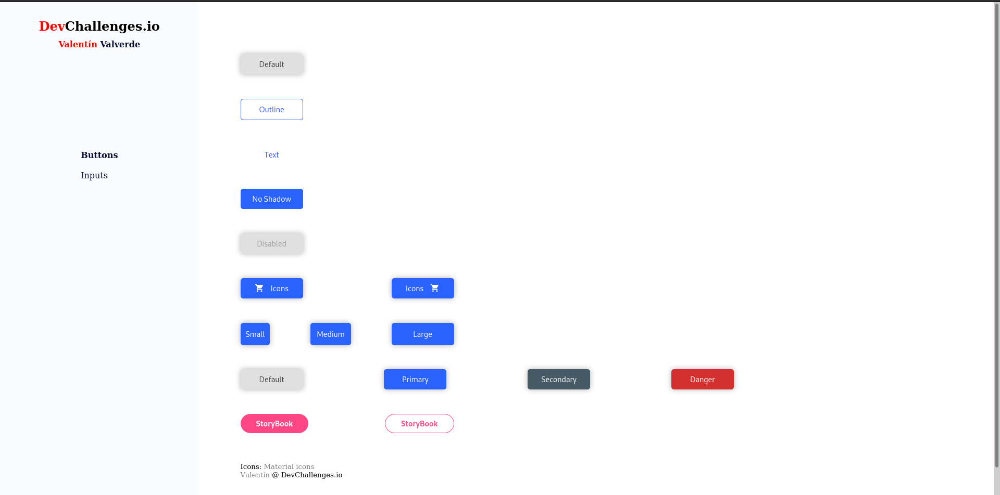
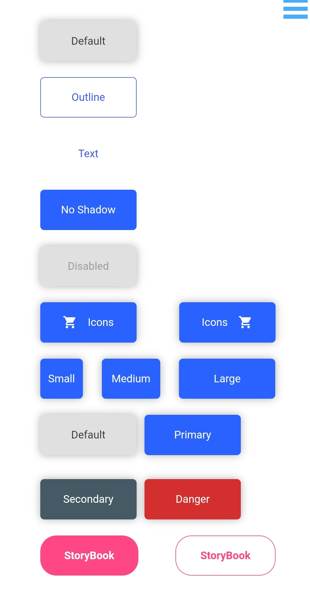

# :bowtie: A [DevChallenge.io](https://devchallenges.io) challenge

Today, we are going doing a challenge of DevChallenges.io. It´s on front-end section (although I think that it´a a design challenge, maybe).

It´s simple, We just need to make some buttons: different sizes, colors, shapes...

Also I´ve made a responsive navbar (sidebar rather) although I have to get better the code organization.

# Run project in localhost

1. First clone this repo:

```
git clone
```

2. Install Node:
   [Nodejs](https://nodejs.org/en/)

3. Run project:
   - If you don´t have Angular CLI installed:
   ```
   npx -p @angular/cli@10 ng serve --port <port you prefer>
   ```
   - If you have Angular CLI installed:
   ```
   ng serve --port <port you prefer>
   ```
   - If you wanna to see the website in your tablet or phone add --host in the previous step

# :eyes: Visit de Demo web

Go to [demo web]()

# :camera: Screenshots

   

